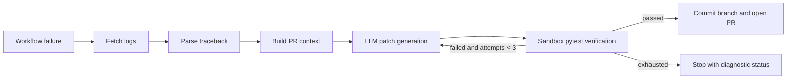

# Agentic PR Triage & Auto-Fix Engine

Production-oriented implementation for parsing failed CI logs, collecting PR context, generating a constrained patch, verifying it, and opening a follow-up pull request.



## Setup

```bash
uv venv && uv pip install -r requirements.txt
# or: python -m venv .venv && pip install -r requirements.txt
export GITHUB_TOKEN=github_pat_...
export OPENAI_API_KEY=sk-...
pytest -q
```

The GitHub token needs repository contents, pull-request, and Actions log permissions. The workflow uses `GITHUB_TOKEN` plus an `OPENAI_API_KEY` repository secret. Configure `LLM_MODEL`, `MAX_VERIFICATION_ATTEMPTS`, `SANDBOX_TIMEOUT_SECONDS`, and `SANDBOX_IMAGE` as needed.

## Local execution

```bash
python -m src.main --repo owner/name --pr 42 --run-id 123456789
```

## GitHub Actions

`agentic-triage.yml` listens for failed runs of the `Test` workflow, downloads logs, and executes the engine. The generated pull request is separate from the failing PR so it remains reviewable and auditable.

## Design notes

The Pydantic state is the contract between LangGraph nodes. The patch generator accepts only structured JSON containing a unified diff, and the verifier applies that diff in a temporary workspace before running pytest. Production deployments should run verification in a hardened container with network disabled and resource limits.
